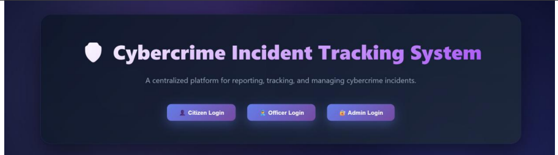
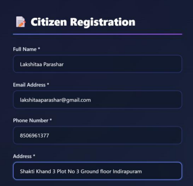
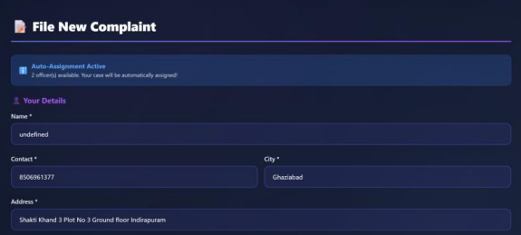
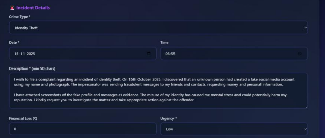
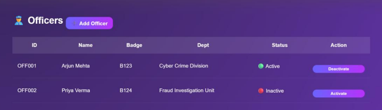
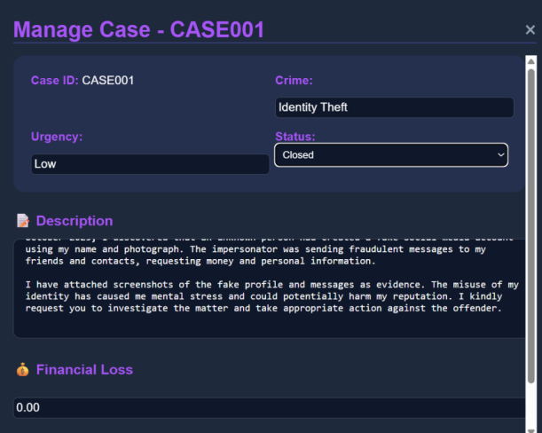
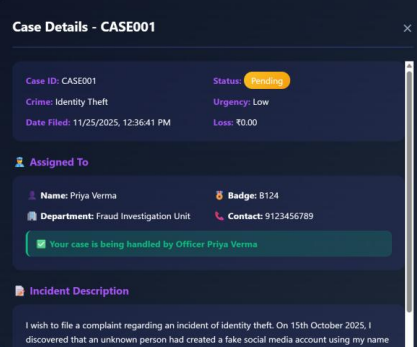

#  Cybercrime Incident Tracking System (CITS)

##  Overview

The **Cybercrime Incident Tracking System (CITS)** is a full-stack application designed to manage and track cybercrime complaints efficiently.

It provides a **role-based system** where:

*  Citizens can report cybercrime incidents
*  Officers can investigate and update cases
*  Admins can manage the entire system

This project demonstrates strong understanding of **DBMS, backend development, and real-world system design**.

---

##  Key Features

### 👤 Citizen Portal

* User registration & login
* File cybercrime complaints
* Upload evidence
* Track complaint status
* View personal dashboard

---

### 👮 Officer Dashboard

* Secure officer login
* View assigned cases
* Update case status (Pending → Investigating → Closed)
* Add investigation notes
* Manage workload

---

### 🔐 Admin Panel

* Admin login system
* View all users & complaints
* Assign/reassign cases to officers
* Monitor system activity
* Manage officers

---

##  System Workflow

```text
Citizen → Files Complaint
        ↓
System assigns Officer
        ↓
Officer investigates & updates case
        ↓
Admin monitors and manages system
```

---

## 🛠️ Tech Stack

* **Frontend:** HTML, CSS, JavaScript
* **Backend:** Python (Flask)
* **Database:** MySQL
* **Concepts Used:**

  * DBMS (Tables, Relations, Queries)
  * REST APIs
  * Role-Based Access Control
  * CRUD Operations

---

##  Output Screenshots

###  Home Screen



---

###  Citizen Registration



---

###  File Complaint



---

###  Complaint Section



---

###  Officer Portal



---

###  Case Management



---

###  Case Details



---

##  How to Run

###  Install Dependencies

```bash
pip install flask flask-cors mysql-connector-python
```

---

###  Setup Database

* Create MySQL database
* Import required tables (schema.sql if available)

---

###  Run Backend

```bash
python app.py
```

---

###  Open Frontend

* Open `index.html` or `gui.html` in browser

---

##  Security Note

Sensitive credentials (like database password) should be stored in environment variables instead of hardcoding.

---

##  Real-World Applications

* Cybercrime complaint management systems
* Law enforcement tracking platforms
* Government grievance systems
* Case management dashboards

---

##  Future Enhancements

* Authentication with JWT
* Email/SMS notifications
* File upload system for evidence
* Live dashboard analytics
* Deployment on cloud (AWS/Render)

---

##  What Makes This Project Stand Out

* Full-stack implementation (Frontend + Backend + DB)
* Role-based system (Citizen, Officer, Admin)
* Real-world workflow simulation
* Clean modular design

---

##  Note

This project demonstrates practical implementation of DBMS and system design concepts in a real-world scenario.

---

##  Author

**Anwesha Sharma**
